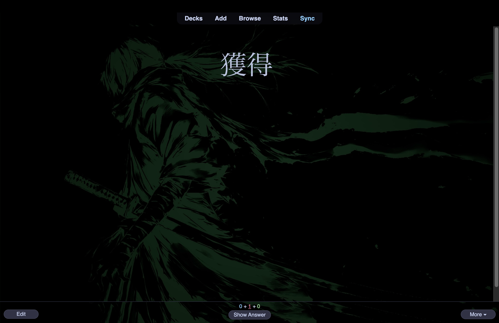
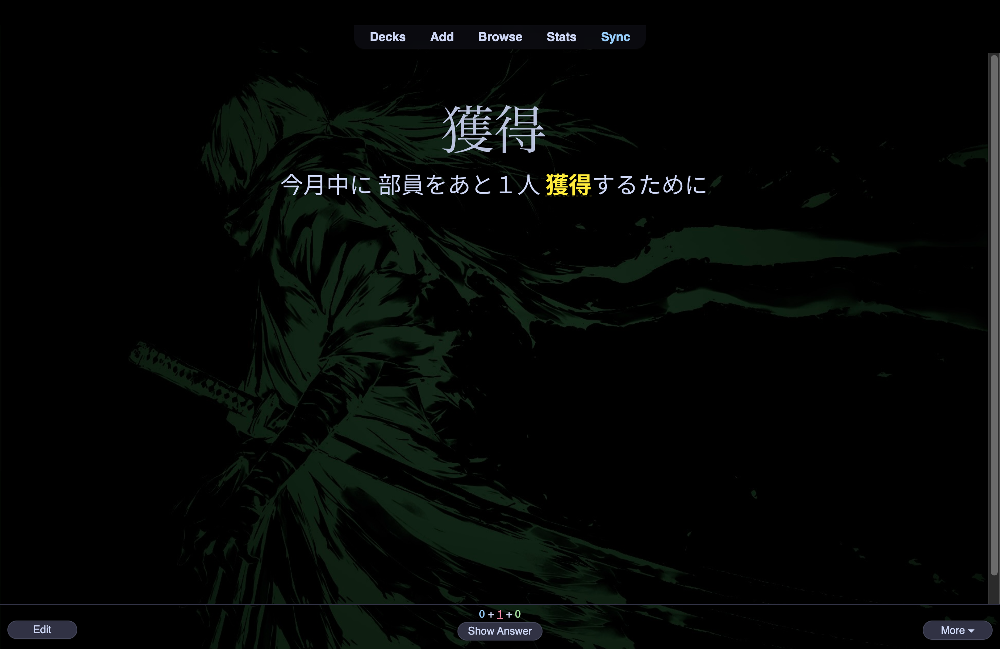
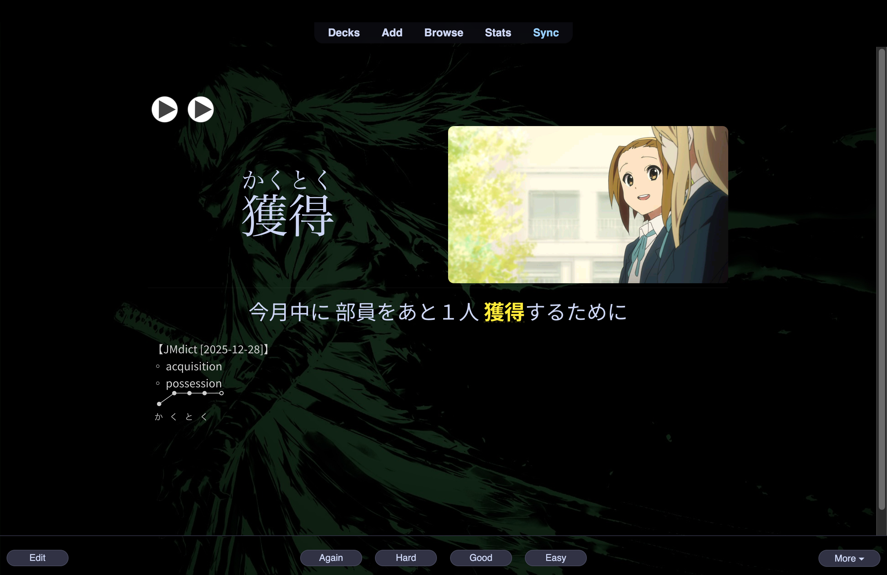
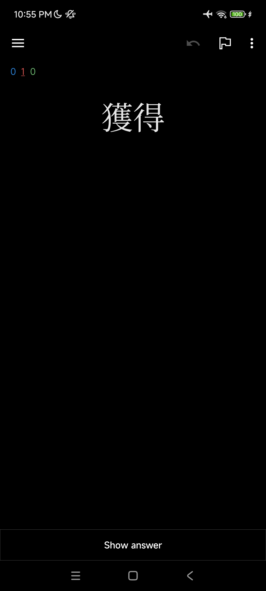
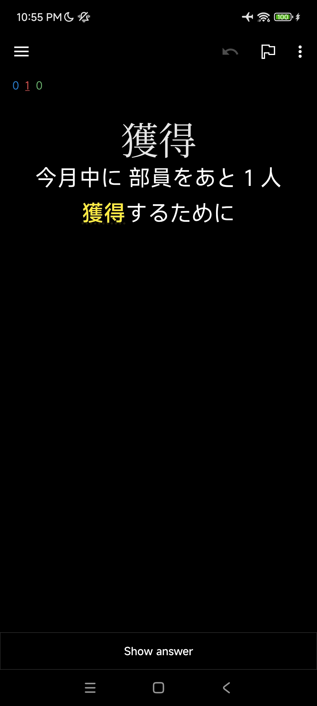
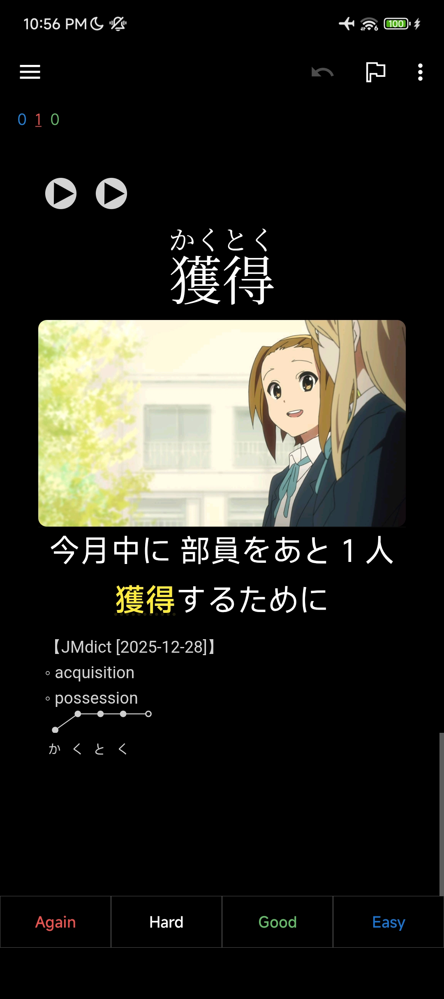
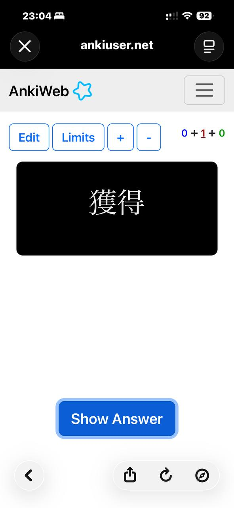
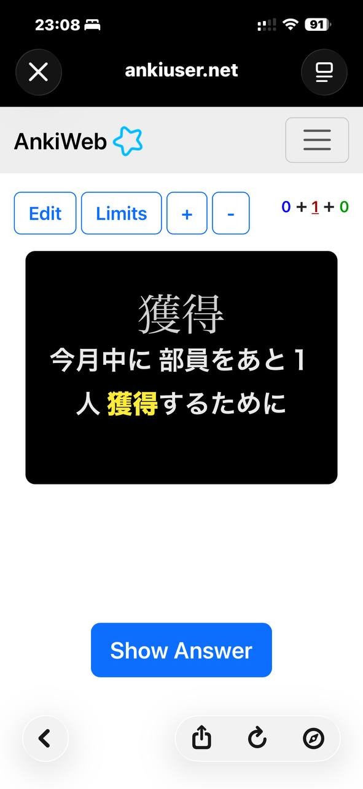
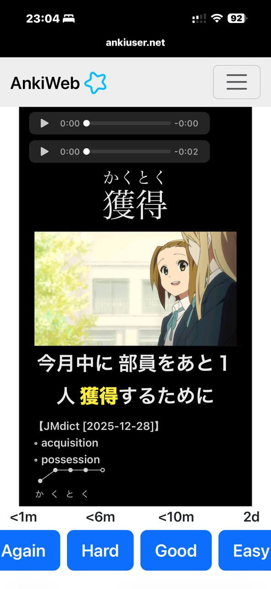

# Jidoujisho-Compatible Anki Note Type (Modified)

This is a lightly modified version of the default **Jidoujisho Anki note type**.

Jidoujisho is quite rigid about Anki export and is only fully compatible with its own note structure, so this keeps **all fields and logic untouched** and only adjusts **HTML / CSS / minimal JS** to improve usability and cross-platform consistency. This note type is fully compatible with Jidoujisho-generated decks. If your deck already works with Jidoujisho, this will too.

---

## What Changed

- Cleaner layout with consistent spacing and font size
- Responsive design (desktop + AnkiDroid, image is placed next to word on desktop)
- Click word on the **front** of the card to reveal / hide the sentence
- Click image to view fullscreen overlay
- Clearer cloze highlighting
- Pitch accent moved to the bottom of the card (Jidoujisho currently exports pitch accent as pre-rendered SVGs which are quite bulky and honestly not very nice to look at, so they’re kept out of the way) 

---

## Screenshots

  
  
  

  
  
  

  
  
  

---

## Installation / Setup

This note type is meant to be **imported as-is**, not pasted over the original Jidoujisho note type.  
Jidoujisho explicitly advises against modifying their default note type.  

**Steps to use:**

1. Download the `.apkg` from this repository  
2. Open Anki (Desktop or AnkiDroid)  
3. Import the deck via **File → Import**. The import will:
   - Add a new note type called something like `JIDOU MODIFIED`  
   - Leave the original Jidoujisho note type untouched  
4. Install the fonts in Anki: [Noto Sans JP](https://fonts.google.com/specimen/Noto+Sans+JP) and [Noto Serif JP](https://fonts.google.com/specimen/Noto+Serif+JP) by placing them into your profile's collection.media folder
5. Perform a sync to ensure the new note type is available in AnkiDroid
6. Create a new export profile in Jidoujisho, mapping the fields exactly as you would in the standard template

Once done, you can:
- Mine new cards using the note type immediately  
- In Anki, open **Cards...** on this note type to tweak layout, colors, font size, JS etc if desired

This deck provides a **baseline layout**. There is plenty of room for improvement: sentence furigana, improved pitch accent display (these can likely be done via addons), and frequency information could be added. To be fair I haven't seen those features in the original Jidoujisho template either. This is just a starting point - feel free to adjust everything to your taste.

---

## Credit

Original note type and field design: Jidoujisho. Modified design inspired by: Senren note type.

Use, modify, or fork as needed.
